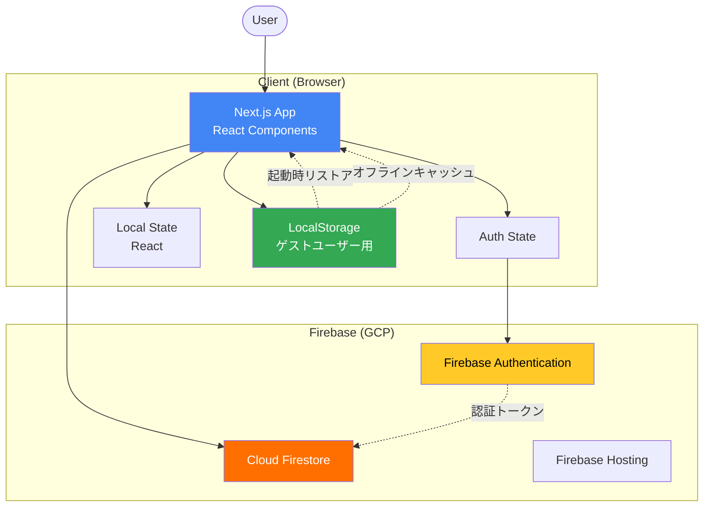
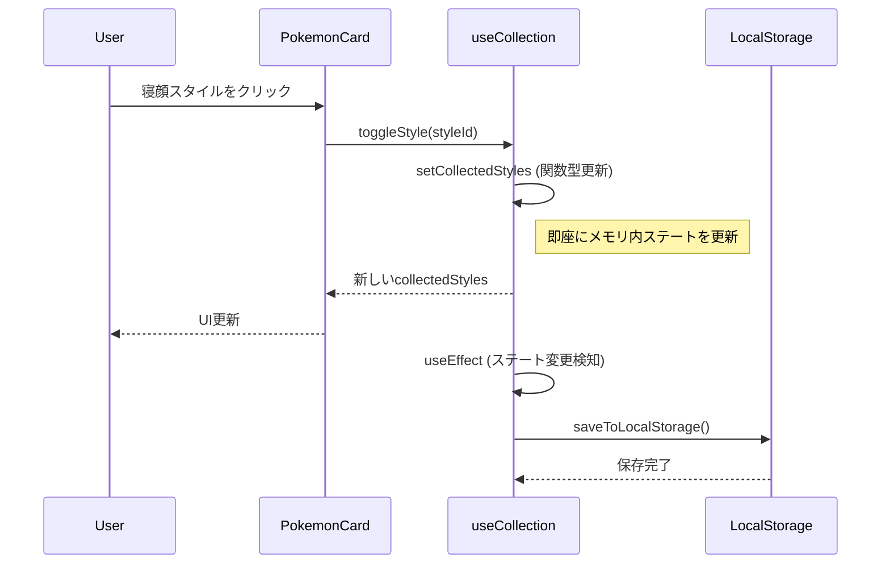
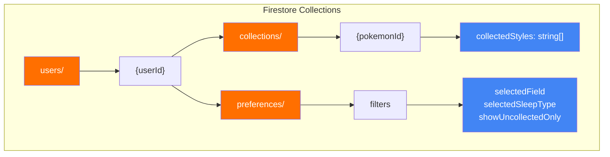
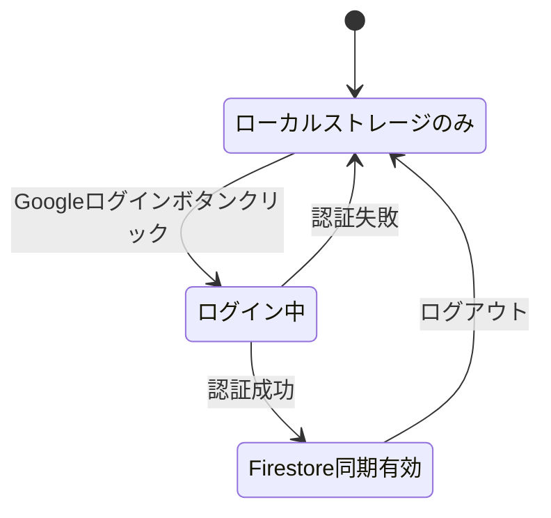
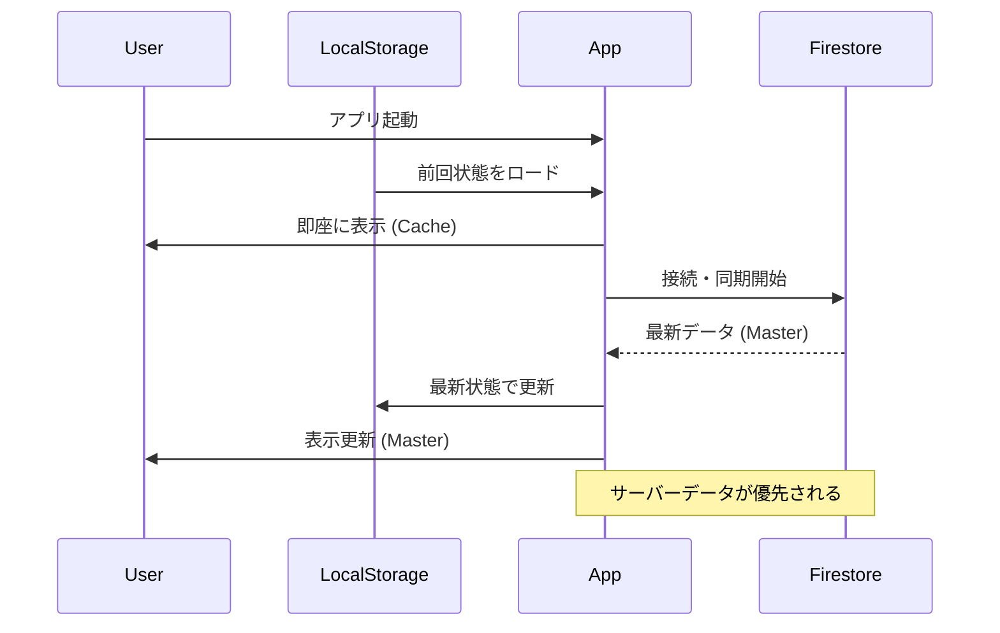
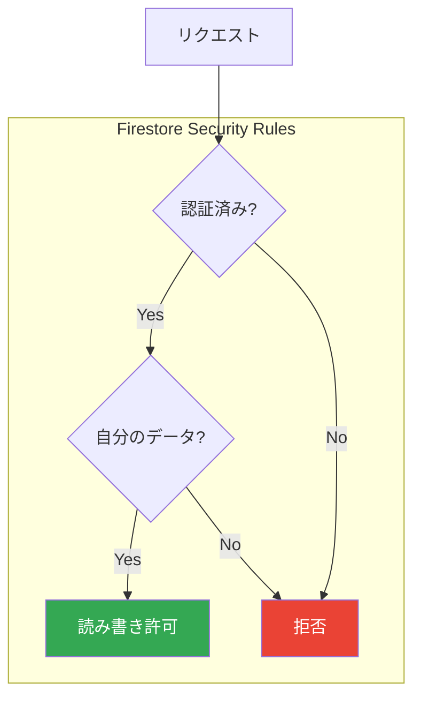
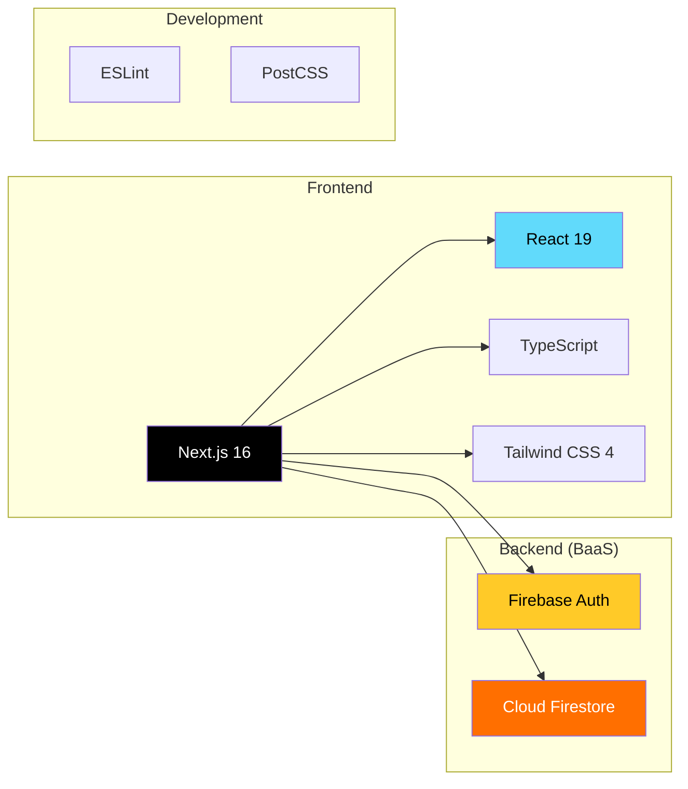
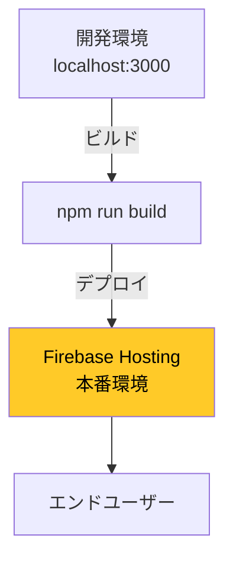

# アーキテクチャ図

このドキュメントは、ポケモンスリープ寝顔図鑑管理アプリのアーキテクチャを図解します。

## システム全体構成



## コンポーネント構成
 
 ```mermaid
 graph LR
     subgraph "Pages"
         Page[app/page.tsx<br/>Main Dashboard]
         Layout[app/layout.tsx<br/>Root Layout]
     end
     
     subgraph "Components"
         AuthBtn[AuthButton]
         PokemonCard["PokemonCard<br/>(Memoized)"]
         FilterPanel[FilterPanel]
         ProgressSummary[ProgressSummary]
         StatusModal[CollectionStatusModal]
         StatusItem[CollectionStatusItem]
         ErrorBoundary[ErrorBoundary]
     end
     
     subgraph "Hooks"
         useAuth[useAuth]
         useCollection[useCollection]
         useFilters[useFilters]
         useProgress[useProgress]
     end
     
     subgraph "Data Layer"
         MockData[mockData.ts]
         DB[lib/db.ts]
         LocalStore[lib/localStorage.ts]
     end
     
     Layout --> ErrorBoundary
     ErrorBoundary --> Page
     
     Page --> useAuth
     Page --> useCollection
     Page --> useFilters
     Page --> useProgress
     
     Page --> AuthBtn
     Page --> PokemonCard
     Page --> FilterPanel
     Page --> ProgressSummary
     Page --> StatusModal
     StatusModal --> StatusItem
     
     useCollection --> DB
     useCollection --> LocalStore
     useFilters --> DB
     
     style Page fill:#4285f4,color:#fff
     style ErrorBoundary fill:#ea4335,color:#fff
     style useCollection fill:#fbbc04,color:#000
 ```
 
 ## データフロー（ログイン時）
 
 ```mermaid
 sequenceDiagram
     participant U as User
     participant Page as app/page.tsx
     participant Hook as useAuth
     participant FB as Firebase Auth
     participant FS as Firestore
     
     U->>Page: アクセス
     Page->>Hook: useAuth()
     Hook->>FB: onAuthStateChanged()
     FB-->>Hook: User認証情報
     Hook-->>Page: user state更新
     
     Page->>FS: useCollection -> subscribeToUserCollection
     FS-->>Page: リアルタイム同期開始
     Page->>Page: collectedStyles更新
 ```
 
 ## データフロー（寝顔選択時 - ログインユーザー）
 
 ```mermaid
 sequenceDiagram
    participant U as User
    participant Card as PokemonCard
    participant Page as app/page.tsx
    participant DB as lib/db.ts
    participant FS as Firestore
    
    U->>Card: 寝顔スタイルをクリック
    Card->>Page: onToggleStyle(styleId)
    Page->>DB: toggleSleepStyle(userId, pokemonId, styleId)
    DB->>FS: setDoc() with arrayUnion/arrayRemove
    FS-->>DB: 書き込み完了
    FS-->>Page: onSnapshot (リアルタイム更新)
    Page->>Page: collectedStyles更新
    Page-->>Card: 新しいcollectedStyles
    Card-->>U: UI更新（チェック状態変更）
```

## データフロー（寝顔選択時 - ゲストユーザー）



## Firestoreデータ構造



### データ例

```json
{
  "users": {
    "user123": {
      "collections": {
        "pikachu": {
          "collectedStyles": [
            "pikachu-1",
            "pikachu-2"
          ]
        },
        "bulbasaur": {
          "collectedStyles": [
            "bulbasaur-1"
          ]
        }
      },
      "preferences": {
        "filters": {
          "selectedField": "all",
          "selectedSleepType": "all",
          "showUncollectedOnly": false
        }
      }
    }
  }
}
```

## 認証フロー



## データ同期フロー（Server Wins戦略）



## セキュリティモデル



## 技術スタック



## デプロイメント構成



## 状態管理フロー
 
 ```mermaid
 graph TB
     subgraph "Custom Hooks"
         useAuth["useAuth<br/>(User State)"]
         useCollection["useCollection<br/>(Collected Styles)"]
         useFilters["useFilters<br/>(Filter State)"]
         useProgress["useProgress<br/>(Calculated Stats)"]
     end
     
     subgraph "UI Components"
         Page[app/page.tsx]
         FilterPanel[FilterPanel]
         PokemonCard[PokemonCard]
         ProgressSummary[ProgressSummary]
     end
     
     useAuth --> Page
     useCollection --> Page
     useFilters --> Page
     useProgress --> Page
     
     Page -->|Props| FilterPanel
     Page -->|Props| PokemonCard
     Page -->|Props| ProgressSummary
     
     FilterPanel -->|Action| useFilters
     PokemonCard -->|Action| useCollection
     
     style useCollection fill:#34a853,color:#fff
     style Page fill:#4285f4,color:#fff
 ```

 ## エラーハンドリング設計

 ### 1. Error Boundary
 - **範囲**: アプリケーション全体 (`app/layout.tsx` でラップ)
 - **捕捉対象**: レンダリング中の予期せぬエラー
 - **動作**: エラー画面を表示し、アプリケーションのクラッシュを防止
 - **開発環境**: エラー詳細（スタックトレース）を表示

 ### 2. 入力バリデーション
 - **場所**: `lib/db.ts`, `lib/localStorage.ts`
 - **対象**: 全てのデータ書き込み操作
 - **チェック内容**:
   - 型チェック (string, boolean, array)
   - 必須値チェック (userId, pokemonId)
   - 空文字チェック
   - 容量制限チェック (LocalStorage 5MB)

 ### 3. 非同期エラー処理
 - **場所**: `hooks/useCollection.ts`
 - **動作**:
   - Optimistic UI更新後のAPI呼び出し失敗をcatch
   - **Toast通知**: `window.alert` の代わりに `ToastProvider` を使用し、非ブロッキングな通知を表示
   - **リトライ**: ネットワークエラー等はFirestore SDKが自動リトライするため、即座にエラーとはしない
   - 重大なエラー（権限等）のみ通知を行う
