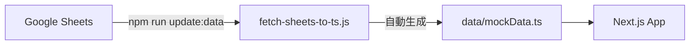

# データ更新ガイド

このプロジェクトでは、ポケモンのデータ（`data/mockData.ts`）をGoogle Sheetsで管理し、スクリプトを使用して自動生成する仕組みを採用しています。

## 1. 概要

- **マスターデータ**: Google Sheets
- **生成されるファイル**: `data/mockData.ts`
- **同期ツール**: `npm run update:data` (`scripts/fetch-sheets-to-ts.js`)



## 2. Google Sheetsの構造

スプレッドシートは以下の3つのシートで構成されています。

### シート1: `Pokemon` (基本情報)

| 列名 | 説明 | 例 |
|------|------|-----|
| dexNumber | 図鑑番号 | `1` |
| name | ポケモン名 | `フシギダネ` |
| type | タイプ | `くさ` |
| sleepType | 睡眠タイプ | `うとうと` |
| fields | 出現フィールド（カンマ区切り） | `ワカクサ本島,ラピスラズリ湖畔` |

> **注意**: `id`は`p{dexNumber}_{name}`の形式で自動生成されます。

### シート2: `Styles` (寝顔情報)

| 列名 | 説明 | 例 |
|------|------|-----|
| pokemonName | ポケモン名（結合キー） | `フシギダネ` |
| styleName | 寝顔の名前 | `こうごうせい寝` |
| rarity | レアリティ（1-4） | `1` |
| locations | 出現場所（カンマ区切り） | `ワカクサ本島,ラピスラズリ湖畔` |

> **注意**: `pokemonName`は`Pokemon`シートの`name`と完全に一致させる必要があります。

### シート3: `Fields` (フィールド定義)

| 列名 | 説明 | 例 |
|------|------|-----|
| name | フィールド名 | `ワカクサ本島` |
| order | 表示順序 | `1` |

## 3. 更新手順

### 基本フロー

1. **Google Sheetsを編集する**
2. **ローカル環境でスクリプトを実行する**
   ```bash
   npm run update:data
   ```
3. **変更を確認し、コミットする**
   ```bash
   git add data/mockData.ts
   git commit -m "chore: update pokemon data"
   git push
   ```

### ケース別手順

#### A. 新しいポケモンを追加する場合

1. `Pokemon`シートに行を追加し、基本情報を入力します。
2. `Styles`シートに行を追加し、そのポケモンの寝顔情報を入力します。
   - `pokemonName`には`Pokemon`シートと同じ名前を入力してください。
3. `npm run update:data`を実行します。

#### B. 寝顔の名前や出現場所を修正する場合

1. `Styles`シートの該当する行を修正します。
2. `npm run update:data`を実行します。

#### C. 新しいフィールドを追加する場合

1. `Fields`シートに行を追加し、フィールド名と順序を入力します。
2. `Pokemon`シートおよび`Styles`シートで、そのフィールドに出現するポケモンの`fields`または`locations`列にフィールド名を追加します。
3. `npm run update:data`を実行します。

## 4. 環境設定

この仕組みを使用するには、以下の設定が必要です。

### .env.local

スプレッドシートIDを設定します。

```env
GOOGLE_SHEETS_ID=your_spreadsheet_id_here
```

### Google Sheetsの公開設定

スクリプトがデータにアクセスできるように、スプレッドシートを以下のいずれかの方法で公開する必要があります：

1. **ウェブに公開（推奨）**
   - 「ファイル」→「共有」→「ウェブに公開」
   - 「ドキュメント全体」を「ウェブページ」として公開

2. **リンク共有**
   - 「共有」→「リンクを知っている全員」に設定

## 5. トラブルシューティング

### Q. `Request failed with status code 403` エラーが出る
**A.** スプレッドシートが公開されていないか、アクセス権限がありません。「ウェブに公開」設定を確認してください。

### Q. `Warning: No styles found for Pokemon "XXX"` と表示される
**A.** `Pokemon`シートに追加したポケモンに対応する寝顔が`Styles`シートに見つかりません。`pokemonName`が正しく入力されているか（スペースの有無など）確認してください。

### Q. データが更新されない
**A.** Google Sheetsの変更が反映されるまで数分かかる場合があります。少し待ってから再度実行してください。また、`npm run update:data`が正常に終了したか（`✅ Successfully generated...`）確認してください。
