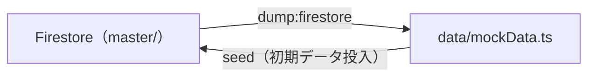

# データ更新ガイド

このプロジェクトでは、ポケモンのマスターデータ（ポケモン一覧、寝顔スタイル、フィールド名）を **Firestore** で管理し、アプリ内の **管理画面 (Admin UI)** から直接更新する仕組みを採用しています。

本ガイドでは、新しい機能やポケモンの追加に伴うマスターデータの更新フローについて説明します。

---

## 1. 概要

以前の「Google Sheetsによる管理と静的ファイルの生成」から移行し、現在はデータベース層へ直接アクセス可能な専用の管理機能（CMS）を備えています。
更新作業はすべてブラウザ上のUIを通じてのみ行われ、コードのビルドやデプロイを伴わず即座に全ユーザーに反映されます。

```mermaid
graph LR
    A[管理者 (ブラウザ)] -->|操作| B[管理画面 (/admin)]
    B -->|CRUD API| C[Firestore (master/)]
    C -->|リアルタイム同期| D[全ユーザーの画面]
```

---

## 2. 管理画面へのアクセス

管理画面へのアクセスには事前に設定された管理者権限が必要です。

1. トップページ（`/`）の右上などにある「Googleでログイン」ボタンからログインします。
2. ログインしたGoogleアカウントの UID が、環境変数 `NEXT_PUBLIC_ADMIN_UIDS` に設定されたリストと一致している場合、ユーザーアイコンの横に「歯車（管理画面）アイコン」が表示されます。
   - ※または、直接ブラウザURL欄に `https://ドメイン名/admin` と入力してアクセス可能です。

> **管理者UIDの設定方法**:
> Firebase Auth の Users タブから該当ユーザーの UID をコピーし、ホスティング環境（またはローカルの`.env`）の `NEXT_PUBLIC_ADMIN_UIDS` にカンマ区切りで追加し再デプロイしてください。

---

## 3. 追加・更新・削除の手順

管理画面には「ポケモン管理」「フィールド管理」「フィールド一括設定」「種ポケモン一括設定」の4つのタブが用意されています。

### A. 新しいポケモンの追加

1. **ポケモン管理**タブの右上にある「+ ポケモン追加」ボタンをクリックします。
2. 追加フォームが展開されるので、各種情報を入力します。
   - **図鑑番号**, **名前**, **タイプ**, **睡眠タイプ** を指定します。
   - **出現フィールド**のチェックボックス（複数可）を選択します。
   - **種ポケモン**（これ以上進化前がいないポケモン）の場合は「種ポケモン」チェックボックスをONにします。ONにすると一覧・カードに「種」バッジが表示され、トップページの「種ポケモンのみ」フィルタの対象になります。
3. **「寝顔スタイル」** では、追加ボタンを押下した時点でデフォルトで「★1〜★4」の空枠が4つ自動生成されます。
   - 各スタイルの名前とレアリティを入力してください。
   - **★5の寝顔**が必要な場合は、「+スタイル追加」で枠を追加し、レアリティ選択で「★5」を指定して手動追加してください（初期4枠は★1〜★4のままです）。
   - **(高度な設定) 除外フィールド**: 特定の寝顔が「ワカクサ本島」など特定のフィールドには"出ない"という仕様がある場合は、チェックボックスをつけることで最適化されたデータ構造で保存されます。
4. 右下の「保存」をクリックすると即座にFirestoreに反映されます。

### B. 既存ポケモンの編集・削除

1. **ポケモン管理**タブにて検索ボックスを活用し、対象ポケモンを探します。
2. リスト上の対象行にマウスをホバーすると現れる「編集」ボタンをクリックします。
3. 項目を書き換えて「保存」を押します。
4. 削除する場合は、対象行の「削除」ボタンを押し、表示される「削除する」ボタンで確定します。

### C. 新しいフィールドの追加

1. **フィールド管理**タブを開きます。
2. 一番下の入力欄に新しいフィールド名（例：`ゴールド旧発電所`）を入力し「追加」を押します。
3. 各行の右側にある「↑」「↓」のアイコンを使って、表示順序を整理します。
4. 最下部の「変更を保存」をクリックし、Firestoreに一括反映します。

### D. フィールド追加時の一括設定 (Bulk)

新しいフィールド（例：ゴールド旧発電所など）が追加された直後、多数のポケモンに対して出現設定を行うための専用画面です。

1. **フィールド一括設定**タブを開きます。
2. 画面上部の**設定対象**ドロップダウンから、設定したいフィールドを選びます。
3. リストから出現対象のポケモンの左端にある**チェックボックスをON**にします。
     - 全体チェックをONにすると、自動的にそのポケモンの持つ全寝顔にもチェックが入ります。
     - **「星3の寝顔だけが出現しない」**ようなケースの場合は、ONになった寝顔のチェックボックスから★3だけを手動で外します。
4. 設定が終わったら、画面右上または下部の**「変更を保存 (X件)」**という緑のボタンをクリックして、Firestoreに一括反映します。

### E. 種ポケモンの一括設定 (Bulk)

複数のポケモンに対して「種ポケモン（これ以上進化前がいない）」フラグをまとめて設定するための専用画面です。個別編集（B）でも1匹ずつ設定できますが、多数を一度に見直す場合はこちらが便利です。

1. **種ポケモン一括設定**タブを開きます。
2. 検索ボックス（ポケモン名・図鑑番号・タイプで検索）で対象を絞り込みます。
3. 種ポケモンに該当する行の**チェックボックスをON**にします（チェック済みの行は緑色で強調されます）。
4. 画面右上の**「変更を保存 (X件)」**ボタンをクリックすると、変更があったポケモンのみがFirestoreへ反映されます。

> **補足**: この画面は元データからの変更差分だけを保持し、保存時に変更分のみ送信します。一度ONにしたチェックを元の状態に戻すと差分から除かれるため、無駄な書き込みは発生しません。

---

## 4. 初期データの投入（シード）

ローカル開発環境を一から構築した場合や、ステージング用Firestoreをクリーンにした直後はデータが空になります。
データが空の状態の時に限り、プロジェクトに同梱されているバックアップデータ（`data/mockData.ts`）からデータを一括投入する機能が解放されます。

1. データが空の状態で管理画面（`/admin`）を開きます。
2. 画面上部に黄色の案内で **「マスターデータが空です」** と表示されます。
3. **「初期データを投入する」** ボタンをクリックします。
4. 全てのフィールドおよびポケモン（★の寝顔含む）が自動でFirestoreに順次アップロードされます。「完了しました！」というメッセージが出たのち自動リロードされれば完了です。

---

## 5. 正データのバックアップ（Firestore → mockData.ts）

管理画面での更新はFirestoreに直接反映されますが、リポジトリに同梱された静的バックアップ（`data/mockData.ts`）は自動では更新されません。最新の正データをバックアップへ書き戻すには、書き出しスクリプトを実行します（セクション4のシードとは逆方向の処理です）。



### 実行方法

```bash
# 本番（master コレクション）を書き出し
npm run dump:firestore

# ステージング（master_staging コレクション）を書き出し
npm run dump:firestore:staging
```

- 実行には Firebase Admin SDK のサービスアカウントキーが必要です。環境変数 `GOOGLE_APPLICATION_CREDENTIALS` にキーのパスを設定してください（`.env` も自動で読み込まれます）。
- 対象環境は `FIRESTORE_ENV`（`production` / `staging`）で切り替わります。`dump:firestore:staging` は `master_staging` コレクションを読み出します。
- 出力時はポケモンを「図鑑番号昇順 → 現行 `mockData.ts` の並び順 → id順」で整列し、差分を最小化します。`isSpecies` フラグは `true` のときだけ出力されます。

> **用途**: 管理画面で更新した内容を、初期データ投入用のバックアップ（`data/mockData.ts`）へ定期的に反映しておくと、ローカル開発環境やステージングを一からシード（セクション4）する際に最新状態を再現できます。

---

## 6. トラブルシューティング

### Q. 管理画面にアクセスすると「アクセス権限がありません」と表示される
**A.** ログインしているアカウントのUIDが環境変数に含まれていません。画面に表示されているUIDをコピーし、`.env` 等の `NEXT_PUBLIC_ADMIN_UIDS` に追加して開発サーバーを再起動（または再デプロイ）してください。

### Q. フィールドを削除したら関連するポケモンはどうなりますか
**A.** ポケモン側の「出現フィールド」や「除外フィールド」の文字列リストにゴミデータとして残る可能性がありますが、表示上の致命的なエラーにはなりません。しかしデータの整合性を保つため、フィールド自体の削除は慎重に行ってください。
