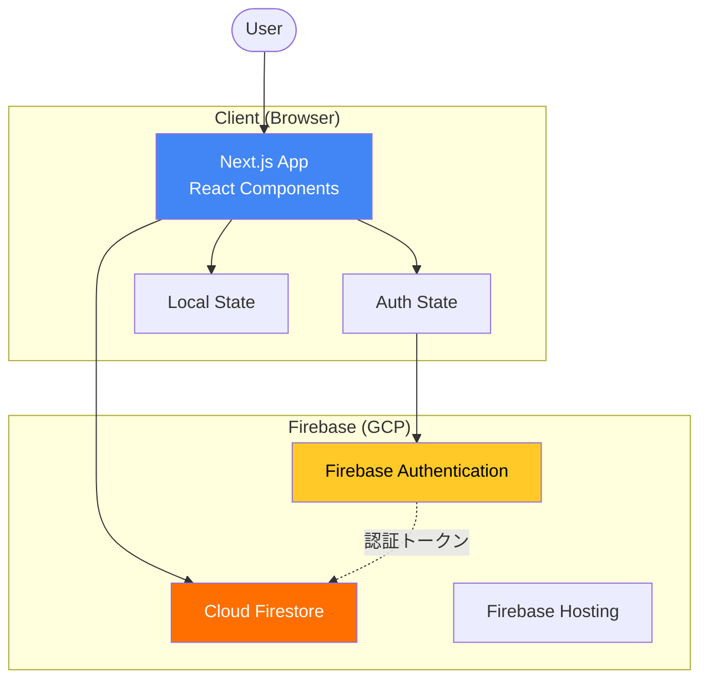
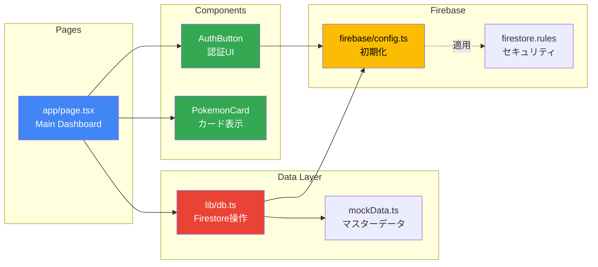
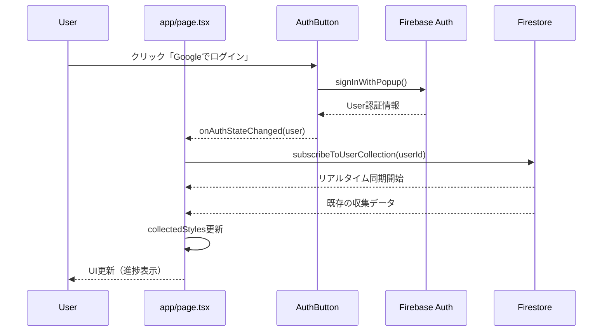
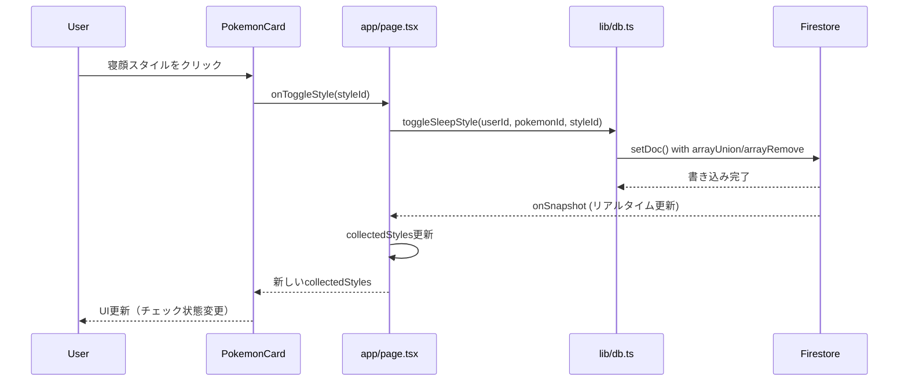
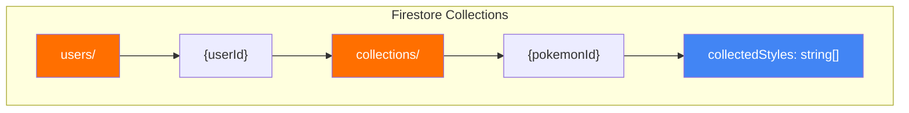
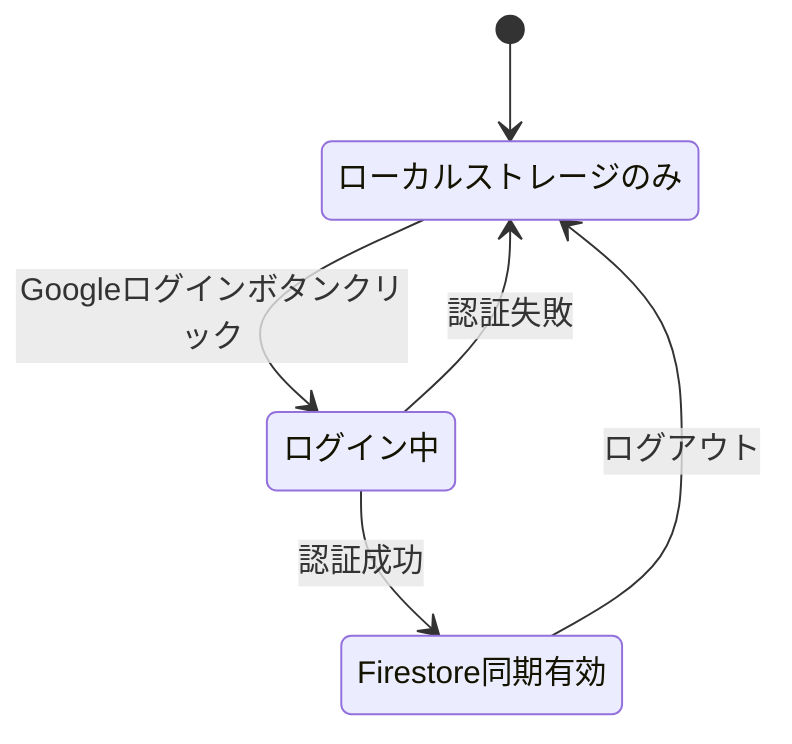
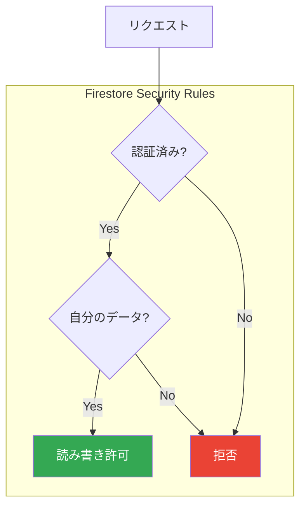
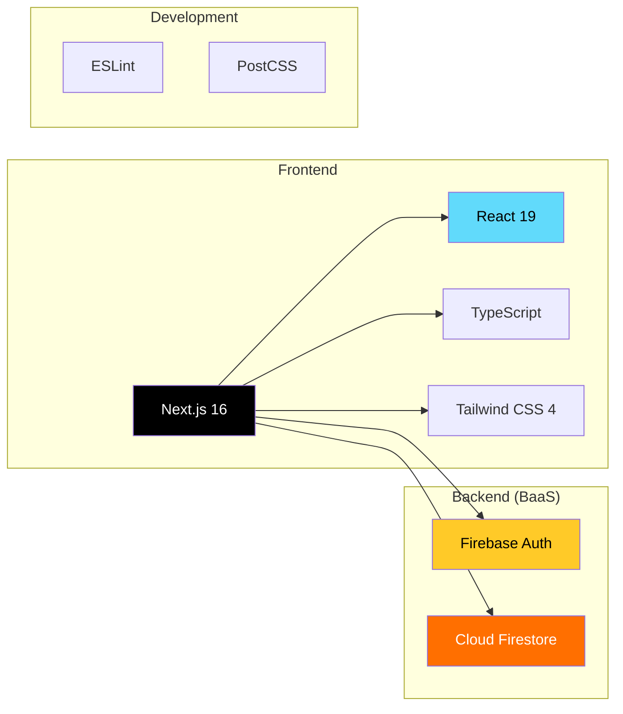
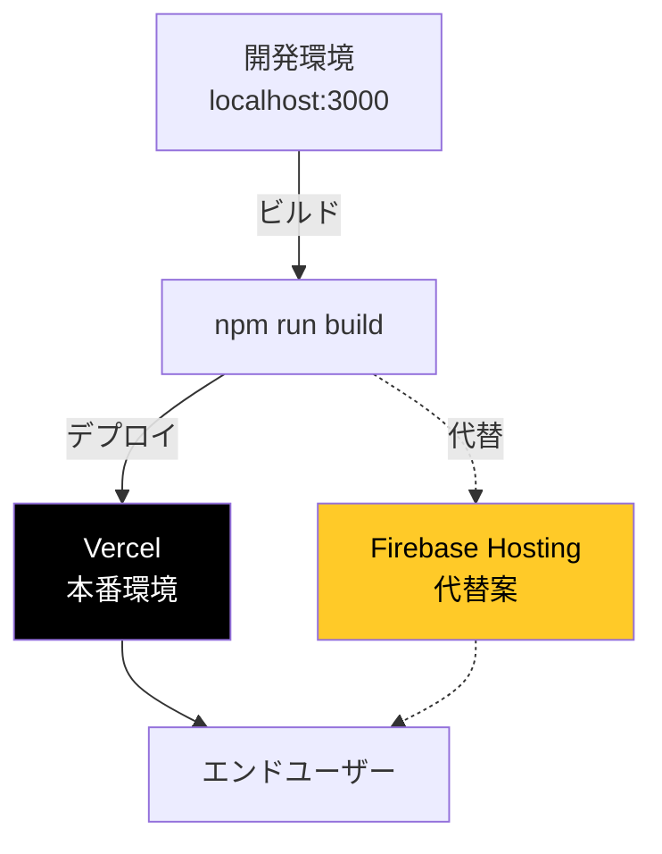
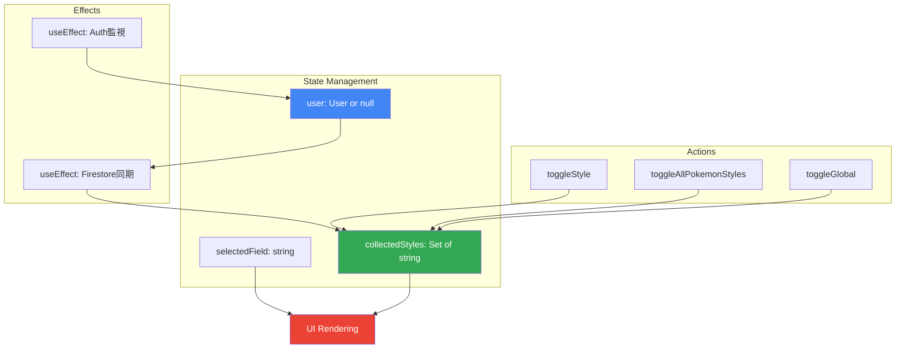

# アーキテクチャ図

このドキュメントは、ポケモンスリープ寝顔図鑑管理アプリのアーキテクチャを図解します。

## システム全体構成



## コンポーネント構成



## データフロー（ログイン時）



## データフロー（寝顔選択時）



## Firestoreデータ構造



### データ例

```json
{
  "users": {
    "user123": {
      "collections": {
        "pikachu": {
          "collectedStyles": [
            "pikachu-1",
            "pikachu-2"
          ]
        },
        "bulbasaur": {
          "collectedStyles": [
            "bulbasaur-1"
          ]
        }
      }
    }
  }
}
```

## 認証フロー



## セキュリティモデル



## 技術スタック



## デプロイメント構成



## 状態管理フロー


